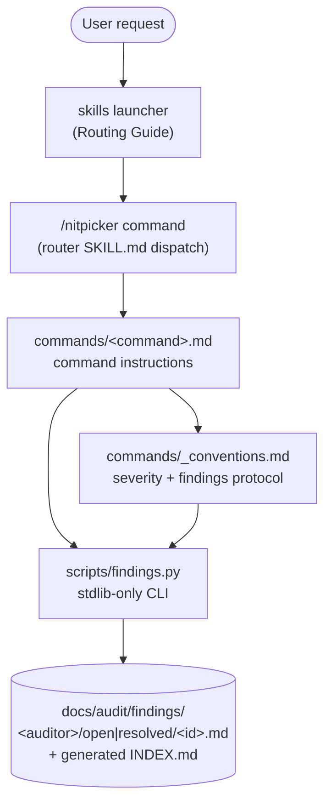

# Skill Wiring Guide

How the public surface (`skills/`) and the internal dev skills
(`.claude/skills/`) fit together in 2.0.

## Overview

**Public surface — one skill.** `nitpicker` is a router
(`skills/nitpicker/SKILL.md`) dispatching its commands, invoked as
`/nitpicker <command> [extra instructions]`. Each command's instructions
live in `skills/nitpicker/commands/<command>.md`; shared conventions
(severity levels, findings protocol, modifiers, rules) in
`commands/_conventions.md`. Per-command descriptions live in the
`## Commands` table of `skills/nitpicker/SKILL.md` — not duplicated here.

**Internal dev skills** (`.claude/skills/`, never shipped):

| Skill             | Purpose                                                                                              |
| ----------------- | ---------------------------------------------------------------------------------------------------- |
| `new-command`     | Orchestrates the full new-command lifecycle (RED → GREEN → REFACTOR → review → validate → PR review) |
| `skill-tester`    | TDD pressure-testing: runs scenarios without/with the skill loaded to prove it changes behaviour     |
| `validate-skills` | Validates the router + command files + internal skills and checks five-file version sync             |
| `release-prep`    | Release-readiness gatekeeper; runs the audit gates, offers to open a PR, never tags or bumps         |
| `skills`          | Launcher — routes a user request to the right `/nitpicker` command (Routing Guide in its SKILL.md)   |

## Audit Flow

The launcher selects exactly one command per request and never chains
commands — the nitpicker router owns any command-to-command hand-off.
Aliases (the 1.x skill names) resolve to canonical command files.

## Dev Lifecycle

Any HIGH/CRITICAL finding at a step loops back to editing the command file;
the loop terminates when review, validation, and PR review are all clean
(see `.claude/rules/skill-lifecycle.md`).

## Release Preparation

`release-prep` runs `validate-skills`, then the **22 audit gates** as
`/nitpicker` commands (`security`, `docs`, `arch`, `audit`, `agent-loopholes`,
`agent-hooks`, `perf`, `tests`, `deps`, `errors`, `migrations`, `observability`,
`contract`, `a11y`, `ci`, `commits`, `concurrency`, `i18n`, `leaks`,
`config`, `privacy`, `unwired`), then `/nitpicker release-gate` as the backstop — it
fails if any open finding at or above the threshold (default High) remains
in the store. Any failed gate stops the run. It never bumps versions or
tags; release-please handles that from `main`.

## Quick Reference: Input/Output

| Surface                                       | Reads                                                                                                           | Writes                                                                                                                  |
| --------------------------------------------- | --------------------------------------------------------------------------------------------------------------- | ----------------------------------------------------------------------------------------------------------------------- |
| Router (`skills/nitpicker/SKILL.md`)          | invocation text (command word + extra instructions)                                                             | nothing — dispatches to a command file                                                                                  |
| Command files (`commands/*.md`)               | `_conventions.md`, the audited repo, installed tools                                                            | findings via `findings.py`; stdout with the `inline` modifier                                                           |
| Findings store (`docs/audit/findings/`)       | —                                                                                                               | open findings under `<auditor>/open/`; resolved appended to `resolved.jsonl`; `INDEX.md` generated, never hand-edited   |
| Bundled scripts (`skills/nitpicker/scripts/`) | store files, PR comments (`fetch-pr-comments.py`), SARIF (`process-sarif.py`), rules (`check-rules-anatomy.py`) | store mutations, stdout — plain `python3`, stdlib-only                                                                  |
| `new-command`                                 | user intent                                                                                                     | `skills/nitpicker/commands/<name>.md` + registration edits                                                              |
| `skill-tester`                                | scenario, skill under test                                                                                      | subagent output (stdout)                                                                                                |
| `validate-skills`                             | router + command files, internal SKILL.md files, five version manifests                                         | stdout (errors/warnings)                                                                                                |
| `release-prep`                                | gate results, findings store, CI status                                                                         | none (optionally opens a PR on explicit approval)                                                                       |
| `skills` launcher                             | user intent                                                                                                     | routes to one `/nitpicker` command                                                                                      |

## New Command Registration Checklist

When adding a command, update all five surfaces (the validator enforces 1–2):

1. `skills/nitpicker/commands/<name>.md` — the command file
   (h1 `# /nitpicker <name> — …`, `## When to use`).
2. The `## Commands` table in `skills/nitpicker/SKILL.md` (1:1 with the files).
3. The Routing Guide in `.claude/skills/skills/SKILL.md`.
4. The command table in `README.md`.
5. `.github/copilot-instructions.md` (if it changes any stated rule or count).

Then `make check` must pass; commit with `feat: add /nitpicker <name> command`.
