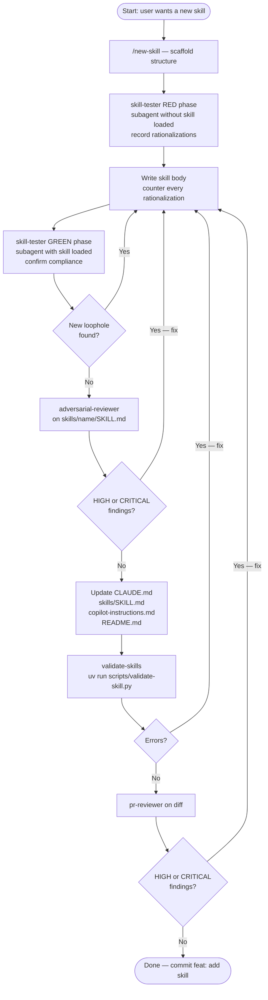
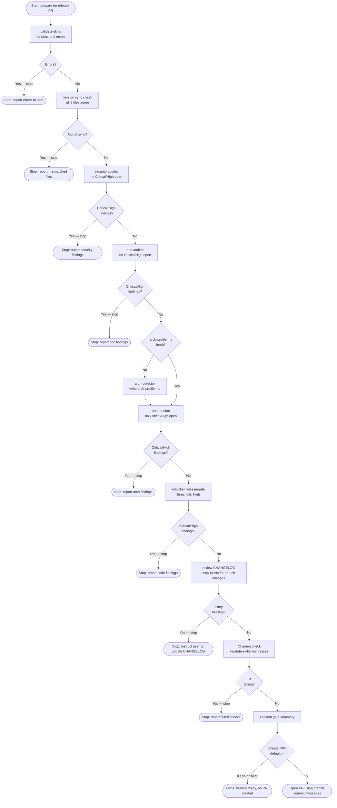
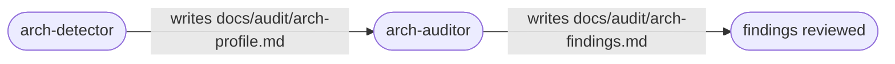
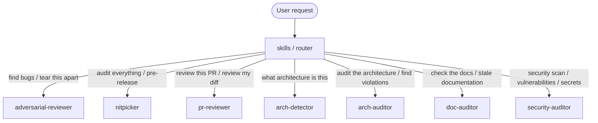
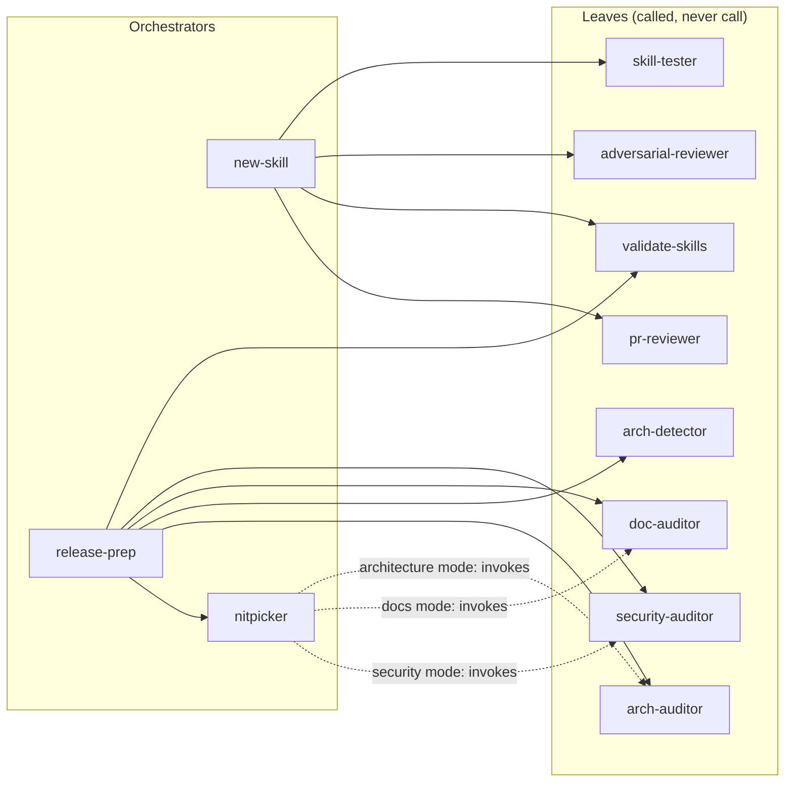

# Skill Wiring Guide

This document explains how the internal dev skills (`.claude/skills/`) and the public
audit skills (`skills/`) work together. It covers which skills invoke which, how they
chain, and the rules that keep the graph acyclic and terminating.

---

## Skill Catalogue

### Internal Skills (`.claude/skills/`)

| Skill | Role |
|-------|------|
| `new-skill` | Orchestrator — scaffolds + drives the full new-skill lifecycle |
| `skill-tester` | Validator — TDD pressure-testing for new skill behaviour |
| `validate-skills` | Leaf — structural linting of SKILL.md frontmatter and format |
| `release-prep` | Orchestrator — validates release readiness and offers to open a PR; never tags or bumps versions |
| `skills` | Router — helps users discover and invoke the right public skill |

### Public Skills (`skills/`)

| Skill | Role | Output |
|-------|------|--------|
| `adversarial-reviewer` | Leaf — hostile bug hunt on specific code or content | stdout |
| `nitpicker` | Orchestrator — exhaustive whole-repo audit with fix integration | `docs/audit/nitpicker-findings.md` |
| `arch-detector` | Leaf — detects architectural patterns | `docs/audit/arch-profile.md` |
| `arch-auditor` | Consumer — validates against detected architecture | `docs/audit/arch-findings.md` |
| `doc-auditor` | Leaf — verifies documentation accuracy against codebase | `docs/audit/doc-findings.md` |
| `pr-reviewer` | Leaf — reviews a PR diff; stdout only, never writes a file | stdout |
| `security-auditor` | Leaf — tool-driven security scan | `docs/audit/security-findings.md` |

**Leaf skills** produce output but do not invoke other skills.
**Orchestrator skills** sequence other skills to accomplish a compound goal.
**Consumer skills** depend on the output of a specific predecessor.

---

## Dependency Graph (static — what reads what)

```mermaid
graph TD
    subgraph internal[".claude/skills — Internal"]
        NS[new-skill]
        ST[skill-tester]
        VS[validate-skills]
        RP[release-prep]
        SK[skills / router]
    end

    subgraph public["skills/ — Public"]
        AR[adversarial-reviewer]
        NP[nitpicker]
        AD[arch-detector]
        AA[arch-auditor]
        DA[doc-auditor]
        PR[pr-reviewer]
        SA[security-auditor]
    end

    subgraph artifacts["docs/audit/ — Shared Artifacts"]
        APF[arch-profile.md]
        AFF[arch-findings.md]
        DF[doc-findings.md]
        SF[security-findings.md]
        NF[nitpicker-findings.md]
    end

    %% arch chain
    AD -->|writes| APF
    AA -->|reads| APF
    AA -->|writes| AFF

    %% doc-auditor reads arch profile for architecture descriptions
    DA -.->|reads if present| APF
    DA -->|writes| DF

    %% security-auditor
    SA -->|writes| SF

    %% nitpicker writes its own findings
    NP -->|writes| NF

    %% new-skill lifecycle
    NS -->|invokes| ST
    NS -->|invokes| AR
    NS -->|invokes| VS
    NS -->|invokes| PR

    %% release-prep gate
    RP -->|invokes| VS
    RP -->|invokes| SA
    RP -->|invokes| DA
    RP -->|invokes| AD
    RP -->|invokes| AA
    RP -->|invokes| NP

    %% router
    SK -.->|routes to| AR
    SK -.->|routes to| NP
    SK -.->|routes to| AD
    SK -.->|routes to| AA
    SK -.->|routes to| DA
    SK -.->|routes to| PR
    SK -.->|routes to| SA
```

Solid arrows (`-->`) are hard dependencies — one skill must run before the other can
operate correctly, or the invoking skill explicitly calls the target. Dashed arrows
(`-.->`) are soft dependencies — the consuming skill works without the predecessor
but produces better output with it, or the invocation is conditional on a specific
mode or the presence of an artifact.

---

## Workflow: Creating a New Skill

The `new-skill` orchestrator drives this full cycle. No step may be skipped.

**Termination guarantee:** Each iteration through the fix loop (`D`) directly
addresses a specific finding. Skills do not loop unless new findings are introduced.
The loop terminates when adversarial-reviewer and pr-reviewer each return no HIGH/CRITICAL
findings, and validate-skills exits clean.

---

## Workflow: Release Preparation

The `release-prep` orchestrator validates readiness and then — **only with explicit
user approval** — offers to open a PR. It never bumps versions, creates tags, or
pushes commits; release-please automation handles all of that when the PR merges to
`main`.

If any gate fails, `release-prep` stops immediately and reports findings. It does not
continue to the next step.

---

## Workflow: Architecture Review

These two skills always run in this order. Running `arch-auditor` before
`arch-detector` is allowed (it detects inline) but produces weaker output.

`doc-auditor` reads `arch-profile.md` when updating architecture descriptions in
docs. Run `arch-detector` before `doc-auditor` if the architecture docs have changed.

---

## Workflow: Ad-hoc Audit Routing

The `skills` router maps user intent to the correct public skill. It does not chain
skills — it selects exactly one based on what the user asked for.

---

## Master Invocation Map

Who calls whom. Leaves have no outgoing edges.

`nitpicker` in focused modes conditionally delegates to the specialist skill. These
are mode-gated invocations: nitpicker invokes the specialist only when explicitly run
in the corresponding mode (`architecture`, `docs`, or `security`). In default mode
nitpicker covers all areas internally and does not invoke the specialist skills.

---

## Acyclicity and Termination Rules

These rules must be maintained whenever skills are modified or new skills are added.

### No Circular Dependencies

| Rule | Rationale |
|------|-----------|
| `arch-auditor` never invokes `arch-detector` | arch-detector is a prerequisite, not a dependent |
| `validate-skills` never invokes any audit skill | It is a pure linter; audit logic lives in the audit skills |
| `adversarial-reviewer` never invokes any other skill | It is a single-purpose leaf |
| `pr-reviewer` never invokes any other skill | It outputs to stdout only; no chaining |
| `skill-tester` never invokes itself | TDD loops are controlled by the caller (`new-skill`), not the tester |
| `release-prep` is never invoked by other skills | It is the terminal orchestrator in the release chain |

### Bounded Iteration

Skills that loop must terminate:

- `new-skill` — iterates only while `adversarial-reviewer` returns HIGH/CRITICAL
  findings, or `skill-tester` finds a compliance loophole. Each iteration must remove
  at least one finding. If no progress is made in two consecutive iterations, stop
  and report the stalemate to the user.

- `nitpicker` — single-shot re-validation of existing findings plus one new scan
  pass. Does not loop indefinitely.

- `release-prep` — each gate either passes (continue) or fails (stop and report). It
  never retries automatically. User must fix findings and re-invoke the skill. If all
  gates pass, the user is asked once whether to open a PR; the default answer is **no**.

### New Skill Registration Checklist

When adding a new skill, verify:

1. It is a **leaf** (calls nothing) or an **orchestrator** (calls only leaves or
   lower-level orchestrators).
2. If it produces an artifact, the artifact path is `docs/audit/<name>-findings.md`
   or `docs/audit/arch-profile.md` (arch-detector only).
3. If it reads another skill's artifact, that predecessor skill is documented as a
   prerequisite in this file and in the new skill's `## When to Use` section.
4. Add it to the Skill Catalogue table and all relevant Mermaid diagrams in this file.
5. Add it to the "Existing Public Skills" table in `.github/copilot-instructions.md`
   and the skills table in `CLAUDE.md` and `README.md`.

---

## Quick Reference: Skill Input/Output

| Skill | Reads | Writes |
|-------|-------|--------|
| `adversarial-reviewer` | code / content passed as argument | stdout |
| `nitpicker` | whole repo | `docs/audit/nitpicker-findings.md` |
| `arch-detector` | repo directory tree + file naming | `docs/audit/arch-profile.md` |
| `arch-auditor` | `docs/audit/arch-profile.md` (optional), codebase | `docs/audit/arch-findings.md` |
| `doc-auditor` | all docs, codebase, `docs/audit/arch-profile.md` (optional) | `docs/audit/doc-findings.md` |
| `pr-reviewer` | git diff / staged changes | stdout only |
| `security-auditor` | codebase, git history, dependency manifests | `docs/audit/security-findings.md` |
| `validate-skills` | all `SKILL.md` files | stdout (errors/warnings) |
| `skill-tester` | scenario description, skill under test | subagent output (stdout) |
| `new-skill` | user-supplied skill name and intent | `skills/<name>/SKILL.md` |
| `release-prep` | all of the above | none (delegates to each skill; optionally opens a PR on user approval) |
| `skills` (router) | user intent | routes to one public skill |
