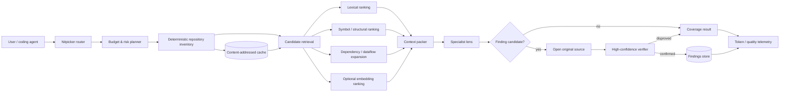

# Making `nitpicker` a Token-Efficient, Best-in-Class Codebase Analysis Skill

## Executive summary

The strongest way to reduce token consumption in coding agents is **not prompt shortening alone**. The largest gains come from preventing irrelevant repository bytes, tool output, repeated instructions, and already-understood state from entering the model context in the first place.

That observation fits `nitpicker` unusually well. The repository already contains several architectural decisions that point in the right direction: commands are loaded on demand, scanner instructions were split into per-tool references, `triage` performs one repository sweep before selecting relevant commands, findings persist outside the conversation, and the `context-mode` rule explicitly tries to keep raw command output outside the model context. fileciteturn3file0L2-L2 fileciteturn5file0L2-L2 fileciteturn9file0L2-L2

The biggest remaining opportunity is to make **context efficiency a first-class architectural property of nitpicker itself rather than a Claude/context-mode convention**.

My recommended target architecture is:

> **deterministic inventory → selective retrieval → compact evidence pack → specialist analysis → verbatim verification → persistent finding**

rather than:

> **read repository → put large outputs in context → reason over everything**

This is supported directly by recent coding-agent research. SWE-Pruner reports **23–54% token reductions on agent tasks** through adaptive pruning, with minimal performance impact and sometimes higher success rates. citeturn13view8 RepoDistill reports input-context reductions of **up to 66% while maintaining comparable performance** using repository-aware compression. citeturn13view9 AIRCoder shows that combining lexical, dependency, and structural retrieval can improve accuracy while substantially improving retrieval efficiency. citeturn13view12 Late Code Chunking finds that retrieving compact representations first and expanding context only afterwards improves repository-level code completion accuracy. citeturn13view13

Conversely, **blind source minification should not be nitpicker's default optimization**. A 2026 study reduced average coding-agent input by 42% through minification but lost **12 percentage points of resolution rate**. citeturn13view10turn13view11 For a tool whose value proposition is finding defects others miss, that is a poor default trade.

My highest-priority recommendations are therefore:

| Priority | Change | Expected effect | Quality risk |
| --- | --- | ---: | --- |
| **Critical** | Add a provider-independent `np_context_pack` / context-firewall tool | Rough engineering target: **20–50% lower repository/tool-result context** | Low if original source is re-opened before filing |
| **Critical** | Split `_conventions.md` into a small always-loaded core plus lazy references | Several thousand input tokens potentially avoided per invocation; exact amount tokenizer-dependent | Very low if binding rules remain in core |
| **Critical** | Add token/cost/quality telemetry to evals | Enables optimization without silently degrading defect recall | None |
| **High** | Introduce symbol/dependency-aware retrieval with late expansion | Likely major savings on large repositories; research also indicates quality gains | Medium implementation complexity |
| **High** | Content-address repository analysis by Git blob/content hash | Near-zero repeated analysis for unchanged artifacts | Cache-invalidation correctness |
| **High** | Add model/effort escalation profiles | Potentially very large cost reduction without reducing repository coverage | Needs multi-model evals |
| **High** | Separate candidate discovery from evidence verification | Lets aggressive compression guide navigation without allowing it to prove findings | Low |
| **Medium** | Stabilize prompt prefixes for provider caching | Up to **90% cached-input discount on eligible reused OpenAI input**; provider-dependent | Almost none |
| **Medium** | Compact machine-facing outputs and summaries | Rough target **20–60% lower output tokens** on bookkeeping/tool turns | Low |
| **Medium** | Batch offline summarization/embedding/evals | **0 token reduction**, but APIs can offer ~50% price reductions | Latency; unsuitable interactively |
| **Low** | Streaming | **0 intrinsic token reduction**; much better time-to-first-finding and UX | None |

These savings are **not additive**. A 40% retrieval reduction followed by another 40% compression does not imply an 80% overall reduction, and prompt caching reduces processing cost rather than the logical number of context tokens. The meaningful target for nitpicker should instead be a quality-normalized metric such as:

```text
\[
\textbf{Token Efficiency}
=
\frac{\text{verified defects found}}
     {\text{uncached input tokens + weighted output tokens}}
\]
```

together with **recall at Critical/High severity** as a hard guardrail.

I would specifically make this a project principle:

> **Compression may decide what to inspect next. Only original source may prove a finding.**

That gives nitpicker permission to be aggressively economical while preserving its hostile-audit philosophy.

## What the current repository gets right — and where tokens are still leaking

The current design is much better than a typical “giant system prompt plus repository dump” agent.

`SKILL.md` acts as a router and explicitly loads `_conventions.md` followed by only the resolved command; specialist commands are deliberately described as cheaper and deeper than the catch-all audit. Scanner-specific instructions have already been moved into individual files that are loaded only if the corresponding scanner is found. fileciteturn3file0L2-L2 That is exactly the progressive-disclosure pattern I would extend throughout the system.

Your instruction-budget rule also recognizes an important distinction: content needed on every turn belongs in the always-loaded set; path-specific material belongs in scoped rules; task-specific material belongs in skills; reference material should be loaded on demand. It currently gates the whole instruction set by directive count rather than individual file size. fileciteturn4file0L2-L2

The `context-mode` rule is another strong foundation. It says that repository listings, grep results, diffs, tests, build output and other inspection results should be processed inside a sandbox so that only selected output enters the model context. fileciteturn5file0L2-L2 Recent research strongly reinforces this design: adaptive pruning of coding-agent read operations is precisely where SWE-Pruner obtains its large reductions. citeturn13view8

And `triage` already implements an important retrieval principle: **sweep once, decide from evidence, inspect command details only where needed**. It places every public command into Recommended, Not applicable, or Unprovable and only opens a command file to disambiguate a trigger. fileciteturn9file0L2-L2

### The main structural inefficiency: the shared convention payload

The first thing I would change is `_conventions.md`.

GitHub currently reports:

| Artifact | Current raw size | Loading behavior |
| --- | ---: | --- |
| `skills/nitpicker/SKILL.md` | **19,450 bytes** | Router/skill context |
| `commands/_conventions.md` | **19,734 bytes** | Required before every nitpicker command |
| `commands/audit.md` | **4,622 bytes** | Audit only |
| `commands/_audit-coverage.md` | **10,328 bytes** | Audit only |

The sizes come directly from current `main`. fileciteturn17file0L2-L2 fileciteturn16file0L1-L2

Raw byte size cannot be translated exactly into tokens without choosing a provider/model tokenizer, but nearly 20 KB of `_conventions.md` on every command is large enough to deserve treatment as a first-class budget.

More importantly, much of `_conventions.md` is **reference information rather than immediate behavioral control**. Its findings-store protocol, MCP/CLI comparison, examples, stale-server discussion and detailed edge cases are useful, but every invocation does not need all of them simultaneously. fileciteturn6file0L2-L2

I would retain a very small mandatory file containing only invariants:

```text
_conventions-core.md

- severity vocabulary
- evidence-before-finding requirement
- task completion/coverage rule
- tool preference order
- untrusted-data rule
- preflight rule
- original-source verification rule
- references to conditional protocols
```

and move details into:

```text
references/protocols/
├── findings-store.md
├── external-tools.md
├── context-budget.md
├── modification-and-verification.md
├── legacy-migration.md
└── pr-provider.md
```

This extends the scanner-reference architecture already present in nitpicker rather than introducing a new philosophy. fileciteturn3file0L2-L2

A conceptual patch:

```diff
diff --git a/skills/nitpicker/SKILL.md b/skills/nitpicker/SKILL.md
@@
 Execution order, always:

-1. Load [commands/_conventions.md](commands/_conventions.md).
+1. Load [commands/_conventions-core.md](commands/_conventions-core.md).
+   This contains only rules binding every command.
+   Load referenced protocols only when their trigger applies.

 2. Load the resolved command.
 3. Execute it with the extra instructions applied.
```

and:

```diff
diff --git a/skills/nitpicker/commands/_conventions-core.md b/skills/nitpicker/commands/_conventions-core.md
new file mode 100644
--- /dev/null
+++ b/skills/nitpicker/commands/_conventions-core.md
@@
+# Nitpicker core conventions
+
+## Evidence
+
+Every finding requires evidence from the original repository source.
+A summary, embedding, compressed representation, scanner synopsis, or
+retrieval score may locate evidence but never constitutes evidence itself.
+
+## Context budget
+
+Prefer the smallest representation that can answer the current question:
+
+1. repository/index metadata
+2. symbol outline
+3. selected source ranges
+4. complete file only when required
+
+Never widen a read merely because the previous representation was compact.
+Widen only when a concrete unresolved question requires it.
+
+## Tool preference
+
+Use a purpose-built np_* tool first.
+For read-only project inspection, use a context-pack tool when available.
+Use direct reads when exact source bytes are required for verification or edits.
+
+## Conditional protocols
+
+- Writing or resolving a finding → load `findings-store`.
+- Invoking an external binary → load `external-tools`.
+- Reviewing a PR → load `pr-provider`.
+- Modifying shipped nitpicker code → load `modification-and-verification`.
```

The important part is not merely making Markdown shorter. Your own instruction-budget rule correctly notes that splitting content **without changing when it loads does not save anything**. fileciteturn4file0L2-L2 The conditional references must genuinely stay outside context until their trigger fires.

### Task tracking is probably duplicating context

`_conventions.md` currently says to copy numbered procedures into the task tracker, while `audit` loads `_audit-coverage.md` and copies its coverage tasks into that tracker. fileciteturn6file0L2-L2 fileciteturn7file0L2-L2

That is excellent for coverage accountability, but copying prose into another model-visible structure can duplicate the very instructions already present.

Use **stable compact IDs** instead:

```text
AUD:C0 correctness
AUD:C1 maintainability
AUD:S0 security
AUD:S1 privacy
AUD:S2 config
...
```

The task tracker needs:

```json
{"id":"AUD:S0","state":"open"}
```

not another paragraph defining injection, authorization, deserialization and scanner behavior. The definitions remain in the manifest/reference and are loaded when that lens runs.

I would ultimately make `_audit-coverage.md` generated from machine-readable data:

```toml
[[lens]]
id = "security"
command = "security"
always_applicable = true
risk = "critical"
trigger = ["source-code"]

[[lens]]
id = "a11y"
command = "a11y"
risk = "high"
trigger = ["ui"]
```

The current coverage checklist deliberately requires every lens to be accounted for and distinguishes `clean`, `N/A`, and `out of scope`. That is a valuable invariant and should remain untouched. fileciteturn8file0L2-L2 Only its representation needs to become cheaper.

### The crucial architectural gap: context-mode is external

At present, context containment depends partly on the context-mode plugin and is explicitly documented as best-effort when that plugin is unavailable. fileciteturn5file0L2-L2

For nitpicker to be genuinely best-in-class across Claude Code, Codex, Copilot, Gemini CLI, pi, Cursor and other harnesses, **context filtering should move into nitpicker's own MCP/CLI surface**.

The existing MCP server already provides bundled-file reading such as `np_read_command`; that tool returns the command's full text. fileciteturn13file6L83-L92

The next major primitive should be something like:

```text
np_context_pack
```

with a contract more like:

```json
{
  "goal": "find unsafe subprocess construction",
  "paths": ["skills/nitpicker/scripts"],
  "mode": "evidence",
  "max_tokens": 6000,
  "changed_only": false,
  "include_dependencies": true
}
```

and output such as:

```json
{
  "budget": {
    "requested": 6000,
    "estimated": 4380
  },
  "candidates": [
    {
      "path": "skills/nitpicker/scripts/foo.py",
      "lines": "84-137",
      "symbols": ["run_scanner"],
      "reason": [
        "subprocess.run",
        "shell argument built from input"
      ]
    }
  ],
  "omitted": {
    "files": 143,
    "reason": "no lexical, symbol, dependency or changed-file signal"
  }
}
```

That turns your existing context-mode philosophy into a **portable nitpicker capability**.

## Token-reduction techniques and how I would apply them

The central distinction is between four different things frequently called “token optimization”:

1. **Logical context reduction** — fewer tokens are actually presented to the model.
2. **Output reduction** — fewer generated tokens.
3. **Cached processing** — the same logical context exists, but its reused prefix is processed more cheaply.
4. **Cheaper execution** — batching or cheaper models lower price without necessarily lowering tokens.

Conflating these makes benchmarks misleading.

### Comparative assessment

| Technique | Likely effect for nitpicker | Implementation | Main risk | Recommendation |
| --- | --- | ---: | --- | --- |
| Selective repository reads | **Very high**; literature reports 23–54% agent-task savings for adaptive pruning | Medium | Missing dependency/evidence | **Do immediately** |
| Symbol-aware chunking | High on medium/large repos | Medium–High | Parser support | **High priority** |
| Diff + enclosing symbols | Extremely high for PR/review workloads; workload-dependent | Low–Medium | Missing unchanged dependency | **Default for review/PR** |
| Structural/dependency expansion | Improves precision of compact retrieval | High | Incomplete language graph | **High priority** |
| Hierarchical cached summaries | High for repeated sessions | Medium | Stale/losing detail | **Navigation only** |
| Prompt-prefix caching | Logical tokens unchanged; OpenAI cached-input discount can reach 90% | Low | Prefix instability | **Do immediately** |
| Content-addressed local cache | Potentially enormous repeated-run savings | Medium | Invalid cache | **Do immediately** |
| Shorter structured outputs | High output-token reduction | Low | Too little explanation | **Do immediately** |
| Low/medium reasoning effort | Often major output/reasoning savings | Low | Hard bugs missed | **Route by risk** |
| Smaller model for routing | Major cost reduction | Low | Misclassification | **Use with escalation** |
| Natural-language semantic compression | Medium–high | Medium | Facts omitted | Useful for docs/logs |
| Source-code minification | Study: 42% input reduction but −12 percentage-point solve rate | Medium | **Accuracy regression** | **Never default** |
| Remove comments before analysis | Potential savings | Low | Comments encode invariants/contracts | Index representation only |
| Whitespace normalization | Small | Low | Source coordinates | Fine in search representation |
| Compact tool JSON | Small–medium repeated savings | Low | Debuggability | Recommended |
| API batching | **0 token reduction**, up to 50% price reduction on supported APIs | Low | Non-interactive latency | Offline workloads |
| Streaming | **0 intrinsic token reduction** | Low | Protocol complexity | UX improvement |
| Multi-agent decomposition | Can increase or decrease tokens | Medium | Repeated context | Only with narrow context contracts |

The SWE-Pruner result supplies the strongest directly relevant empirical range: **23–54% lower token use** across coding-agent tasks. citeturn13view8 RepoDistill demonstrates that considerably stronger compression is possible with a specialized repository compressor, reporting **up to 66% input reduction at comparable performance**. citeturn13view9 These should be treated as research results rather than promises for nitpicker.

### Prompt engineering: make “what may enter context” explicit

Most token-oriented prompts are too vague:

```text
Be concise.
Read only relevant files.
Avoid wasting tokens.
```

Those are weak because the model must decide what “relevant” and “wasting” mean.

A stronger nitpicker convention would define a **context escalation protocol**:

```markdown
## Context acquisition

Acquire repository evidence progressively.

Level A — metadata
Use file names, languages, manifests, symbol/index metadata and search hits.

Level B — outline
Use imports, exports, signatures, declarations and dependency edges.

Level C — evidence range
Read the smallest contiguous source range that can answer the current question.

Level D — full file
Use only when control/data flow cannot be resolved from ranges.

For each widening A→B→C→D, have a concrete unresolved question.
Do not widen pre-emptively.

A finding may be filed only after Level C or D evidence has been checked
against the current original file.
```

The requirement to verify original code protects you from the failure mode demonstrated by aggressive minification. citeturn13view10

Prompt for **bounded outputs**, too:

```text
Return:
- finding candidates: max 8
- each candidate: path, line range, class, one-sentence reason
- no remediation yet
- no repository summary
- no restatement of the task
```

Then remediation can be generated only for verified candidates.

This is better than asking for one giant audit report because generated tokens are expensive in both latency and usually price. OpenAI's latency guidance states that generation is generally the dominant LLM latency component and gives the heuristic that cutting output by 50% can approximately cut generation latency by 50%. citeturn13view5

Another useful pattern is **facts rather than narrative** between agent stages:

```json
{
  "path": "src/auth.py",
  "range": [73, 106],
  "signals": ["tainted-input", "sql-execute"],
  "confidence": 0.89
}
```

instead of:

```text
After carefully reviewing the authentication subsystem, I noticed that
there appears to be an interesting potential interaction...
```

Narrative belongs in the final finding, not intermediate state.

### Model selection, effort, temperature and response length

Model choice should be **risk-adaptive rather than command-wide**.

As of September 10, 2026, OpenAI's model guidance recommends GPT-6 Astra for its hardest coding/reasoning work, GPT-5.6 Terra where intelligence/cost balance matters, and GPT-5.6 Luna for high-volume cost-sensitive work. Those families also expose reasoning-effort controls. citeturn15search0turn15search2turn15search3 Model names will continue moving, so nitpicker should describe **capability tiers**, not hard-code vendor names into command prose.

I recommend four execution tiers:

| Tier | Work | Model characteristics | Effort |
| --- | --- | --- | --- |
| Deterministic | inventory, grep, AST, dependency graph, hashing, diff, dedup | **No model** | none |
| Scout | trigger classification, query rewriting, summary refresh, candidate ranking | Small/cheap | low |
| Analyst | ordinary specialist analysis | Balanced coding model | medium |
| Verifier | Critical/High candidates, ambiguous flows, conflicting evidence | Frontier | high/xhigh only when justified |

Anthropic explicitly describes lower effort as reducing token expenditure and making tool calls fewer/terser, while warning that capability can decline; its docs recommend tuning effort against eval results. citeturn15search6 Google's Gemini documentation similarly exposes a `thinking_level` control and recommends lower thinking when complex reasoning is unnecessary. citeturn15search10

For nitpicker this suggests:

```yaml
model_policy:
  inventory:
    kind: deterministic

  triage:
    tier: scout
    effort: low
    max_visible_output: 1200

  standard_lens:
    tier: analyst
    effort: medium
    max_visible_output: 3000

  high_risk_verification:
    tier: verifier
    effort: high
    max_visible_output: 6000
```

The host coding agent may not expose model switching. That means **model policy belongs in a portable capability declaration plus harness adapters**, not as an assumption inside every skill. In a single-model harness the same design still works: deterministic retrieval saves context, and low/medium/high can degrade gracefully to prompt-level depth guidance.

Temperature is secondary. Where a conventional model exposes it, low temperature is sensible for deterministic classification/extraction, but **lower temperature is not itself a token-saving mechanism**. For modern reasoning models, effort/thinking controls and output budgets are the more meaningful levers. Do not simultaneously tighten every control: a tiny `max_tokens` can truncate exactly the difficult investigation you care about. The right policy is a generous hard ceiling plus a lower behavioral effort for cheap stages.

### Code-aware chunking and retrieval

For repository analysis, fixed “every 1,000 tokens” chunks are the wrong abstraction.

A useful chunk is a semantic code object:

```text
module
class
function/method
configuration object
CI job
Terraform resource
SQL migration
test case
```

with metadata:

```json
{
  "symbol": "TokenSafeRedirectHandler.redirect_request",
  "path": "skills/nitpicker/scripts/pr_common.py",
  "lines": [311, 354],
  "imports": ["urllib.request"],
  "calls": ["credential_safe"],
  "called_by": ["request"],
  "tokens": 492
}
```

Recent repository-level retrieval work strongly favors this direction. AIRCoder combines textual similarity, dependency information and structural hierarchy and reports both higher exact-match accuracy and 10.2× higher retrieval efficiency than its best baseline. citeturn13view12 DraCo builds repository-specific dataflow relations and reported improvements in both exact match and identifier F1 compared with its evaluated state of the art. citeturn13view14

Most relevant to nitpicker is **late expansion**. Late Code Chunking separates:

- a compact **retrieval representation**, and
- a larger **comprehension representation** expanded only after retrieval.

That design improved exact-match accuracy 19.7% over the best chunking method in its CrossCodeEval experiments. citeturn13view13

For nitpicker:

```text
retrieval representation:
    symbol name
    signature
    file path
    imports
    callees/callers
    literal/API names
    short normalized body fingerprint

after selection:
    exact original body
    adjacent guards
    relevant definitions
    callers/callees
```

This is much safer than minifying every file before analysis.

### Comments, minification and diffs

Treat code as having two representations.

**Search representation:**

```python
def transfer(user, amount): ...
```

plus symbols, calls and dependency edges.

**Evidence representation:**

```python
def transfer(user: User, amount: Decimal) -> Receipt:
    # Retry is deliberately disabled: payment provider operation is not idempotent.
    ...
```

Comments can contain security properties, operational assumptions, compatibility constraints and explanations of deliberately unusual code. Removing them before final reasoning can destroy exactly the evidence an auditor needs.

The empirical warning is strong: source minification has been measured to reduce coding-agent input substantially while also reducing successful resolution. citeturn13view10

Therefore:

```text
identifier renaming              NEVER
blind comment deletion           NEVER for verification
format/whitespace minification   only retrieval representation
signature-only skeletons         YES for candidate discovery
diff-only review                 YES, plus dependency expansion
full original code               YES when verifying
```

For PR analysis, make the preferred context:

```text
changed hunk
+ enclosing declaration
+ symbols referenced by changed lines
+ callers affected by changed contract
+ changed tests / tests covering symbol
```

rather than entire changed files.

That gives `review` and `pr` a natural token advantage while still catching bugs whose manifestation lies outside the literal diff.

### Semantic compression

Natural-language material is a better compression target than source code.

For:

- README files,
- architecture documents,
- previous session summaries,
- build logs,
- test output,
- scanner reports,
- dependency metadata,

semantic compression can work well. LLMLingua demonstrated very high prompt-compression ratios on general NLP workloads, including up to 20× compression with little loss in its evaluated datasets. citeturn13view15 Those results are not a guarantee for code auditing, so I would restrict such compressors to **navigation/context material**, not proof.

A particularly valuable pattern for nitpicker is hierarchical state:

```text
repository map
    ↓
package summaries
    ↓
file summaries
    ↓
symbol summaries
    ↓
original source on demand
```

Every summary should carry:

```json
{
  "source_sha256": "...",
  "generator_version": "nitpicker-summary-v2",
  "facts": [...],
  "symbols": [...],
  "dependencies": [...]
}
```

and invalidate automatically when source changes.

### Caching: two different caches

Nitpicker can benefit from **local semantic caching** and **provider prompt caching**, which solve different problems.

For the local cache, key every deterministic artifact from content rather than timestamps:

```text
cache key =
    repository identity
  + git blob/content SHA
  + analyzer version
  + parser version
  + retrieval schema version
```

Cache:

```text
language detection
symbols
imports
call/dependency edges
file fingerprints
normalized search representation
embedding
summary
scanner-normalized result
```

Then changing one file invalidates only that file and graph edges connected to it.

For an unchanged file:

```text
parse:       cache hit
embedding:   cache hit
summary:     cache hit
analysis:    reuse only where scope/model policy permits
```

Do **not** indiscriminately reuse previous audit verdicts; a dependency or caller may have changed even when the file did not. Cache the evidence/index aggressively; cache correctness conclusions with dependency fingerprints.

Provider prompt caching should be treated separately. OpenAI's current prompt cache reuses an unchanged prompt prefix, can discount reused input by up to 90%, and requires the rendered prefix to match; OpenAI specifically recommends stable prefixes and cache breakpoints around reusable content. citeturn13view0turn14view1turn14view0 Usage exposes cached and cache-write token counts, so this is directly measurable. citeturn13view2

Therefore order requests like this:

```text
[stable]
nitpicker core protocol
stable tool definitions
severity/evidence contracts
command definition

[semi-stable]
repository architecture summary / index version

[dynamic]
user request
current diff
retrieved evidence
new tool results
```

not:

```text
current timestamp
current git diff
user-specific dynamic material
nitpicker instructions
tool definitions
```

Putting changing material early destroys prefix reuse.

Anthropic likewise exposes cache-creation and cache-read usage counters and explicit prompt-cache boundaries. citeturn14view5 Provider rate-limit semantics differ: OpenAI says cached prompt tokens still count toward token-per-minute limits, whereas Anthropic currently excludes cache-read input from ITPM for most models. citeturn14view1turn16search0 Your abstraction therefore needs distinct:

```text
logical_input_tokens
uncached_input_tokens
cache_read_tokens
cache_write_tokens
output_tokens
provider_rate_limit_tokens
actual_cost
```

rather than one ambiguous `tokens` metric.

## Proposed nitpicker architecture and concrete integration

I would make “context packs” the central new primitive.



The important safety property is that the compressed retrieval branch cannot write directly to the findings store.

### Add a repository context-pack tool

A portable version could initially avoid embeddings entirely and still yield substantial savings.

```diff
diff --git a/skills/nitpicker/scripts/mcp_server.py b/skills/nitpicker/scripts/mcp_server.py
@@
 import findings
 import pr_common
 import skill_catalog
+import context_pack

@@
+@tool(
+    "np_context_pack",
+    "Return a bounded, evidence-oriented repository context pack. "
+    "Use for inspection; reopen original source before filing a finding.",
+    {
+        "type": "object",
+        "properties": {
+            **_PROJECT_DIR_PROP,
+            "goal": {"type": "string"},
+            "paths": {
+                "type": "array",
+                "items": {"type": "string"}
+            },
+            "mode": {
+                "type": "string",
+                "enum": ["inventory", "symbols", "diff", "evidence"]
+            },
+            "budget_tokens": {
+                "type": "integer",
+                "minimum": 256
+            },
+            "changed_only": {"type": "boolean"}
+        },
+        "required": ["goal", "mode", "budget_tokens"],
+        "additionalProperties": False
+    },
+    {**_READ_ONLY, "title": "Build repository context pack"},
+)
+def _context_pack(args: dict) -> str:
+    root = _project_root(args)
+    result = context_pack.build(
+        root=root,
+        goal=args["goal"],
+        paths=args.get("paths", []),
+        mode=args["mode"],
+        budget_tokens=args["budget_tokens"],
+        changed_only=args.get("changed_only", False),
+    )
+    return json.dumps(result, separators=(",", ":"))
```

Notice `separators=(",", ":")`: pretty-printed JSON is useful for humans, but machine-facing tool results do not need indentation. Your existing `np_list_commands` path currently serializes JSON with indentation; compact serialization is a tiny optimization individually but worth making a convention because tool results recur many times. fileciteturn15file0L1-L2

The first `context_pack.py` version can remain compatible with nitpicker's stdlib-only philosophy:

```python
"""Build bounded repository evidence packs without placing raw command output in context."""

from __future__ import annotations

from dataclasses import dataclass
from pathlib import Path
import re
import subprocess


@dataclass(frozen=True)
class Candidate:
    """A source region that may answer the current audit question."""

    path: Path
    start: int
    end: int
    score: float
    reason: tuple[str, ...]


def changed_files(root: Path) -> list[Path]:
    """Return paths changed from HEAD without returning the diff itself."""
    proc = subprocess.run(
        ["git", "diff", "--name-only", "HEAD"],
        cwd=root,
        check=True,
        text=True,
        capture_output=True,
    )
    return [
        root / line
        for line in proc.stdout.splitlines()
        if line
    ]


def lexical_candidates(
    root: Path,
    files: list[Path],
    terms: set[str],
) -> list[Candidate]:
    """Rank matching lines while retaining bounded source coordinates."""
    candidates: list[Candidate] = []

    for path in files:
        try:
            lines = path.read_text(encoding="utf-8").splitlines()
        except (OSError, UnicodeError):
            continue

        for index, line in enumerate(lines):
            matched = tuple(
                term for term in terms
                if re.search(rf"\b{re.escape(term)}\b", line, re.IGNORECASE)
            )
            if not matched:
                continue

            # A small navigation window, not final evidence.
            start = max(0, index - 12)
            end = min(len(lines), index + 13)
            candidates.append(
                Candidate(
                    path=path.relative_to(root),
                    start=start + 1,
                    end=end,
                    score=float(len(matched)),
                    reason=matched,
                )
            )

    return sorted(candidates, key=lambda item: item.score, reverse=True)
```

I would *not* stop there. The mature implementation should support pluggable parsers:

```text
ContextProvider
├── GitDiffProvider
├── LexicalProvider
├── TreeSitterSymbolProvider
├── LspReferenceProvider
├── DependencyProvider
├── EmbeddingProvider
└── ScannerEvidenceProvider
```

so nitpicker remains useful with zero optional dependencies but gets much more precise when tree-sitter/LSP/embedding infrastructure exists.

### Add a context budget to every specialist

A command should declare what kinds of context it usually needs rather than each agent improvising.

Example:

```yaml
context:
  discovery:
    - inventory
    - symbols
    - lexical
  expansion:
    - callers
    - callees
    - tests
  full_file: exceptional
  evidence_requires_original: true
```

Security may request dataflow expansion; docs may need public APIs and documentation; CI may need entire workflow jobs but essentially no application source.

This can eventually become metadata adjacent to command definitions:

```toml
[commands.security.context]
signals = ["trust-boundary", "subprocess", "query", "deserialization", "auth"]
expand = ["callers", "callees", "config"]
risk = "critical"

[commands.docs.context]
signals = ["public-api", "cli", "configuration"]
expand = ["docs"]
risk = "medium"
```

Then `triage`, `audit` and standalone commands all consume the same machine-readable policy.

### Make `audit` exhaustive in coverage but selective in context

This distinction is central.

Your current `audit` contract explicitly makes exhaustiveness depend on addressing every coverage lens. fileciteturn8file0L2-L2 I would **not** weaken that to save tokens.

Instead:

```text
exhaustive coverage ≠ every lens reads every file
```

An efficient exhaustive audit should be:

```text
repository inventory once
    ↓
each lens receives the same inventory
    ↓
lens-specific trigger/filter
    ↓
small candidate set
    ↓
structural expansion
    ↓
only relevant original source enters reasoning context
```

A security lens needs proof that it considered the entire relevant attack surface; it does not need every CSS file in context. An a11y lens needs proof that UI surfaces were enumerated; it does not need Python scanner-provider internals.

`triage` already demonstrates the underlying concept by deriving applicability from concrete repository signals. fileciteturn9file0L2-L2 I would extract that inventory engine into code and let both `triage` and `audit` consume it.

### Persistent incremental state

Nitpicker already has a strong primitive that many agents lack: a persistent findings store. fileciteturn6file0L2-L2 Extend that idea to analysis state.

For example:

```text
.git/nitpicker/
├── index/
│   ├── manifest.json
│   ├── symbols.sqlite
│   └── graph.sqlite
├── cache/
│   └── <content-hash>.json
└── runs/
    └── <run-id>.jsonl
```

Using `.git/nitpicker` avoids polluting a project's committed tree by default.

A run event could be:

```json
{"t":"lens","id":"security","state":"running"}
{"t":"read","path":"src/auth.py","range":"70-118","tokens":714}
{"t":"candidate","class":"sql-injection","path":"src/auth.py","line":91}
{"t":"verified","candidate":"abc","result":true}
{"t":"finding","id":"security-..."}
{"t":"lens","id":"security","state":"findings-filed"}
```

The agent never needs to reproduce the entire history in prose. A new context can reconstruct state from a compact run ledger.

### Streaming and incremental outputs

Streaming should be implemented, but classify it correctly: **streaming does not inherently reduce token count**. It improves time-to-first-useful-output and perceived responsiveness. OpenAI's current latency guidance calls streaming one of the strongest ways to reduce perceived waiting time. citeturn14view8

The token-saving opportunity comes from **incremental semantics**, not SSE itself.

Bad:

```text
turn 1: findings 1-3
turn 2: findings 1-7
turn 3: findings 1-11
turn 4: final findings 1-17
```

Good:

```text
turn 1: finding 1
turn 2: finding 2
...
final: counts + unresolved coverage + finding IDs
```

Because the canonical findings already live on disk, the final response does not need to repeat their complete bodies.

### Batch and rate-limit strategy

Batching is valuable for:

```text
embedding changed symbols
refreshing file summaries
offline benchmark evaluation
LLM-as-judge grading
duplicate-finding clustering
large scheduled repository audits
```

It is not appropriate for an interactive “review this diff now” path.

OpenAI's Batch API currently offers a **50% cost discount**, a separate higher-rate-limit pool and completion within 24 hours; a batch can contain up to 50,000 requests. citeturn13view3turn13view4 Anthropic likewise currently documents a 50% Batch discount. citeturn16search7 This is a price optimization, not a token optimization.

A provider abstraction should therefore expose:

```python
class Usage:
    logical_input_tokens: int
    uncached_input_tokens: int
    cache_read_tokens: int
    cache_write_tokens: int
    reasoning_tokens: int
    visible_output_tokens: int
    total_output_tokens: int
    cost_usd: float
    latency_ms: int
```

and scheduling should account separately for RPM, input-token and output-token constraints. Anthropic, for example, currently rate-limits Messages by RPM, ITPM and OTPM and treats cached input differently from ordinary input on most models. citeturn16search0

API call count also matters. OpenAI's latency guidance recommends combining sequential calls where possible and parallelizing truly independent operations. citeturn14view6turn14view7 For nitpicker, however, do not combine unrelated lenses into one giant prompt merely to save round trips: that reintroduces the context pollution you are trying to eliminate.

## CI, benchmarks and cost-versus-quality controls

This is the part I consider non-negotiable.

You already have behavioral evals under `skills/nitpicker/evals/evals.json`, including command selection, changed-files behavior, unknown-command fallback, severity filtering and no-invented-findings behavior. fileciteturn10file0L2-L2 What the eval suite currently lacks is **resource accounting**.

Token optimization without a quality baseline will eventually optimize nitpicker into a cheaper, worse auditor.

### Measure quality and resources together

Every benchmark run should emit:

```json
{
  "case": "python-subprocess-taint-03",
  "model": "provider/model",
  "mode": "standard",
  "quality": {
    "expected_findings": 3,
    "true_positive": 3,
    "false_positive": 0,
    "false_negative": 0,
    "critical_recall": 1.0,
    "high_recall": 1.0,
    "evidence_accuracy": 1.0
  },
  "usage": {
    "logical_input_tokens": 38142,
    "uncached_input_tokens": 9277,
    "cache_read_tokens": 28865,
    "output_tokens": 4819,
    "tool_result_tokens": 11204,
    "repository_source_tokens": 19410
  },
  "execution": {
    "model_calls": 7,
    "tool_calls": 29,
    "full_file_reads": 2,
    "range_reads": 17,
    "cache_hit_ratio": 0.76
  }
}
```

I would make the primary dashboard metrics:

| Metric | Why it matters |
| --- | --- |
| Critical recall | Hard safety/quality floor |
| High recall | Hard quality floor |
| Precision | Prevents “efficient” noisy audits |
| Evidence-line accuracy | Proves retrieval has not detached findings from source |
| Reproduction success | Separates suspicion from verified defect |
| Tokens / verified finding | Main efficiency measure |
| Uncached input / verified finding | Better provider-cost measure |
| Output tokens / finding | Detects verbose reports |
| Tokens / clean lens | Finds waste where no defect exists |
| Full-file-read ratio | Measures retrieval quality |
| Context utilization | How much retrieved context contributes to result |
| Cache hit ratio | Incremental-performance signal |
| Time to first verified finding | UX/latency |
| Cost / verified finding | Operational optimization |
| Duplicate-finding rate | Cross-lens efficiency |
| Run-to-run variance | Reliability |

Do **not** optimize only `tokens / finding`: an auditor that misses all findings has excellent token consumption. The numerator and recall floors have to be evaluated independently.

### Build `NitpickerBench`

I would add three benchmark classes.

**Seeded micro-repositories** should contain one deliberately controlled defect at a time:

```text
benchmarks/repos/
├── python-command-injection/
├── python-race/
├── ts-type-escape/
├── react-a11y/
├── terraform-public-storage/
├── gha-expression-injection/
├── retry-non-idempotent/
└── cache-key-collision/
```

These answer: *does the lens know the defect class?*

**Historical regression repositories** should use real repositories at `parent-of-fix` and `fix` commits:

```text
bad revision    → finding expected
fixed revision  → same finding forbidden
```

These answer: *does nitpicker find realistic defects without inventing them?*

Finally, **adversarial large-repository cases** should place the relevant evidence among large amounts of irrelevant but superficially similar code. This specifically tests retrieval and long-context behavior. That matters because long-context models do not necessarily use all positions equally well; the “Lost in the Middle” work found substantial degradation when relevant material was buried in the middle of long contexts. citeturn13view16

### Add differential context-budget tests

For every serious retrieval optimization, compare:

```text
FULL-CONTEXT BASELINE
vs
BUDGETED CONTEXT
```

with the quality gate:

```text
Critical recall: must not decrease
High recall:     must not decrease beyond configured tolerance
Precision:       must not materially decrease
Evidence:        100% original-source verified
Tokens:          should decrease by target
```

A suggested CI policy:

```toml
[quality]
critical_recall_min = 1.00
high_recall_min = 0.97
evidence_accuracy_min = 1.00

[efficiency]
median_input_regression_max = 0.03
p95_input_regression_max = 0.05
median_output_regression_max = 0.05

[retrieval]
original_source_verification = 1.00
full_file_read_ratio_max = 0.20
```

Those numbers are starting policies to tune against your own benchmark, not externally established universal thresholds.

The most important design is **asymmetry**:

```text
quality regression → blocks
token regression → blocks after modest tolerance
quality improvement + token increase → human review
quality unchanged + token decrease → accept
```

Do not permit a token win to automatically compensate for a Critical-recall loss.

### Measure instruction tokens, not only instruction counts

Your existing `check-agent-instructions.py` is a good semantic guard: it warns above its instruction threshold and fails above its hard limit. fileciteturn4file0L2-L2 Keep it.

Add a complementary tokenizer-aware check:

```text
check-agent-instructions.py   → complexity/directive budget
check-context-tokens.py       → actual token budget
```

The second should report per provider/model tokenizer where practical:

```text
Instruction token report

                                OpenAI     Claude*    Gemini*
SKILL.md                         4,821       ...        ...
_conventions-core.md               914       ...        ...
security.md                      2,240       ...        ...
total security invocation        7,975       ...        ...

* provider-native count endpoint where supported
```

Do not use a `characters / 4` estimate as a CI gate. Approximation is useful for planning; a budget gate should count using the tokenizer or provider token-count endpoint actually being benchmarked.

A useful pull-request visualization would be:

```text
                          main     PR       delta
always-loaded tokens      2,911    2,936     +0.9%
nitpicker core            5,014    3,182    -36.5%
security invocation       9,101    7,087    -22.1%
audit initial context    12,833    8,906    -30.6%
```

and a historical chart:

```text
x-axis: commit/date
y-axis: median tokens / verified finding
secondary series:
  Critical recall
  High recall
  p95 cost/run
```

That makes a token improvement impossible to celebrate while the recall line falls.

### Cost-quality Pareto frontier

For every model/effort/context-budget combination, plot:

```text
x = cost or total uncached tokens
y = verified-defect recall
```

Discard dominated points.

For example:

```text
small / low / 8k context
balanced / medium / 12k
balanced / high / 12k
frontier / medium / 12k
frontier / high / 24k
```

The best configuration is not necessarily the cheapest point. It is the cheapest point meeting the quality floor.

This is especially important because current provider models expose multiple cost/effort tiers. OpenAI's model catalog currently spans cost-sensitive GPT-5.6 Luna, balanced Terra, flagship Sol and higher-end Astra-class reasoning. citeturn15search0turn15search2turn15search3turn15search7 Anthropic likewise explicitly recommends changing effort according to measured workload requirements rather than assuming maximum effort everywhere. citeturn15search6

## Beyond token savings: what would make nitpicker genuinely best-in-class

Token efficiency should become one quality dimension rather than nitpicker's identity. The more interesting opportunity is to turn the project into a **measurably high-recall repository-analysis framework**.

### Make evidence provenance stronger than competitors

Every finding should eventually carry machine-readable provenance:

```yaml
evidence:
  commit: 9f...
  path: src/auth.py
  lines: 73-91
  blob_sha: ...
  source_hash: ...
  analyzer: security
  retrieval:
    method: dependency+lexical
    context_pack: cp-...
  verification:
    original_source_read: true
    reproduction: test/security/test_auth.py::test_injection
```

This makes `reverify` dramatically cheaper because it can first ask:

```text
Did evidence blob change?
Did any dependency edge relevant to this finding change?
Did reproduction test change?
```

before invoking a language model.

That also enables a useful finding lifecycle:

```text
signal
→ candidate
→ source-verified
→ reproduced
→ filed
→ fixed
→ regression-verified
```

A scanner hit should not be epistemically equivalent to a reproduced bug.

### Introduce a retrieval-quality benchmark

The model should not carry all blame for missed findings.

Score the retriever independently:

```text
Given defect X:
did the relevant file enter top 5?
did the relevant symbol enter top 10?
did dependency expansion reach the real cause?
how many irrelevant tokens were packed before it?
```

Metrics:

```text
Recall@K
MRR
relevant-token precision
relevant-token recall
bytes read from disk
tokens exposed to model
```

CodeRAG research broadly warns that retrieval quality and the generator's ability to exploit retrieved context are separate failure points; repository retrieval should therefore be evaluated independently rather than only through final model output. Recent structural retrieval results such as AIRCoder, DraCo and Late Code Chunking further support treating this as its own system component. citeturn13view12turn13view13turn13view14

### Add a “known-positive” philosophy to every analyzer

Every scanner, parser and retriever should have controls that prove it still detects something known.

For retrieval:

```text
known symbol exists
→ search must return it

known dependency edge exists
→ graph query must reach it

known changed hunk references symbol
→ expansion must include declaration
```

For security scanners:

```text
scanner returns zero
+ self-test positive detected
→ credible clean result

scanner returns zero
+ self-test positive missed
→ scanner failure, never clean
```

This makes “clean” an evidenced claim rather than an empty output.

### Export standard formats

The current findings store is a good human-reviewable project artifact. fileciteturn6file0L2-L2 Keep it, but add machine exports:

```text
np_export_findings --format sarif
np_export_findings --format json
np_export_findings --format junit
```

SARIF gives immediate interoperability with code-scanning interfaces; JSON gives other agent frameworks a stable API; JUnit-style summaries make CI visualization easy.

The Markdown files remain canonical human evidence, while structured export is generated.

### Make language intelligence extensible

A best-in-class repository auditor needs more than embedding similarity.

Define an adapter protocol:

```python
class CodeIntelligenceProvider(Protocol):
    def symbols(self, path: Path) -> Sequence[Symbol]: ...
    def references(self, symbol: Symbol) -> Sequence[Reference]: ...
    def dependencies(self, symbol: Symbol) -> Sequence[Edge]: ...
    def enclosing_symbol(self, path: Path, line: int) -> Symbol | None: ...
```

Potential implementations:

```text
fallback/text
Python AST
tree-sitter
LSP
language-specific compiler index
```

Nitpicker should work with the fallback but automatically exploit richer providers when installed.

That preserves your current “never install external tooling automatically” philosophy while allowing much deeper analysis.

### Treat uncertainty as a routing signal

A sophisticated audit should not merely output a confidence number. Confidence should change execution:

```text
low-risk + high-confidence clean
    → close lens

high-risk + high-confidence candidate
    → original-source verification

high-risk + low-confidence
    → wider dependency expansion
    → stronger model/effort
    → reproduction attempt

conflicting static/model evidence
    → independent verifier
```

This is how model selection and context budgeting become correctness mechanisms rather than cost knobs.

### Keep important evidence at context boundaries

When constructing context packs, place:

```text
top:
    task
    audit invariant
    compact repository/context map

middle:
    supporting source

bottom:
    strongest relevant evidence
    exact question to answer
```

The rationale is empirical: long-context experiments have repeatedly observed poorer utilization of information buried in the middle than information placed near the beginning or end. citeturn13view16

Do not duplicate entire source snippets at both ends; duplicate only tiny identifiers or the analytical question.

### Recommended roadmap


I would execute the roadmap in the following order:

| Order | Work | Reason |
| --- | --- | --- |
| **Now** | Split mandatory conventions into core + conditional references | Cheap, low-risk recurring reduction |
| **Now** | Add token/resource telemetry to eval runs | Every subsequent optimization needs measurement |
| **Now** | Add `np_context_pack` with inventory/diff/lexical/range modes | Largest architectural improvement |
| **Now** | Require original-source verification after compressed retrieval | Makes aggressive optimization safe |
| **Next** | Content-addressed repository index/cache | Huge benefit for active iterative development |
| **Next** | Compact task IDs and machine outputs | Eliminates bookkeeping repetition |
| **Next** | Symbol-aware chunking | Better retrieval and smaller source payload |
| **Next** | Changed-hunk + enclosing-symbol + dependency expansion | Especially valuable for `review`, `pr`, `cr` |
| **Next** | Quality/resource CI budgets | Prevents gradual regression |
| **Then** | Structural graph and LSP/tree-sitter adapters | Enables deeper cross-file reasoning |
| **Then** | Risk-adaptive model/effort policies | Large operating-cost optimization |
| **Then** | Cached file/package/repo summaries | Strong multi-session efficiency |
| **Then** | Optional hybrid embeddings | Useful additional signal, not sole retriever |
| **Then** | SARIF/JSON/JUnit exports and dashboards | Ecosystem and UX |
| **Then** | Learned context compression experiments | Only after benchmark can prove no recall loss |

The benchmark criterion I would use for declaring the token-efficiency work successful is not “50% fewer tokens.” It is:

> **At least the same Critical/High defect recall as the full-context baseline, with materially fewer uncached input and output tokens, lower cost per verified finding, and no degradation in evidence accuracy.**

A stretch goal of roughly **30–50% lower end-to-end input context** is defensible given current coding-agent pruning research, but should remain a measured target rather than a design assumption. SWE-Pruner's 23–54% agent-task reduction gives that target empirical grounding; RepoDistill suggests greater compression may eventually be possible with repository-specialized learned components. citeturn13view8turn13view9

The resulting design has an important competitive advantage: **nitpicker can become more exhaustive while reading less into the model**. Exhaustiveness is then provided by deterministic inventory, coverage accounting and selective expansion—not by hoping a model attends correctly to a giant context window.

That is the direction I would pursue for the project: not merely “use fewer tokens,” but **build the most evidence-efficient code auditor possible**.

### Primary sources and research basis

The most directly relevant research is **SWE-Pruner: Self-Adaptive Context Pruning for Coding Agents**, which reports 23–54% token reductions on agentic coding tasks. citeturn13view8 **RepoDistill** demonstrates repository-specific learned context compression with input reductions up to 66% while maintaining comparable performance. citeturn13view9 **AIRCoder** supports hybrid textual/dependency/structural retrieval. citeturn13view12 **Late Code Chunking** supports compact retrieval followed by context expansion. citeturn13view13 **DraCo** provides evidence for dataflow-guided repository retrieval. citeturn13view14 **Reducing Token Usage of State-in-Context Agents using Minification** provides the strongest warning against blind code compression, measuring a 42% input reduction alongside a 12 percentage-point resolution loss. citeturn13view10 **LLMLingua** provides the semantic-compression foundation for prose and other non-evidence context. citeturn13view15 **Lost in the Middle** motivates careful context packing rather than equating large context windows with reliable information utilization. citeturn13view16

For production implementation, the relevant current provider documentation is OpenAI's **Prompt Caching**, which documents prefix matching, cached usage and discounts. citeturn14view1turn13view2 OpenAI's **Batch API** documents its 50% asynchronous discount and batch limits. citeturn13view3turn13view4 OpenAI's **Latency Optimization** guidance covers shorter generation, request consolidation, parallelization and streaming. citeturn13view5turn14view6turn14view7turn14view8 Current OpenAI model-selection guidance provides the cost/capability tiering used above. citeturn15search0 Anthropic's current **Effort** documentation directly supports risk-adaptive effort control, and its rate-limit documentation explains cache-aware token accounting. citeturn15search6turn16search0 Google's current Gemini documentation likewise exposes model thinking-level controls for latency/cost tradeoffs. citeturn15search10

The strongest conclusion across those sources is remarkably consistent: **do not solve repository-scale agent efficiency by giving the model a bigger pile of text and asking it to work harder. Route, retrieve, compress, cache and verify.**
